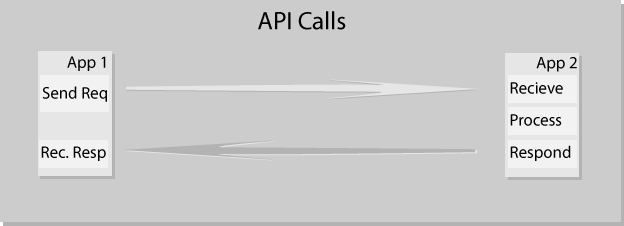
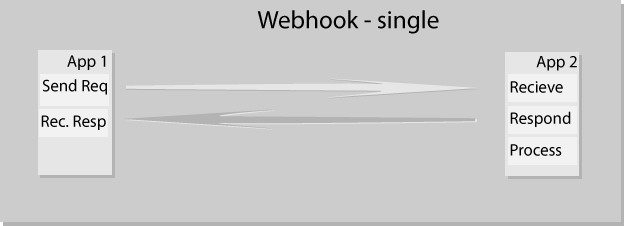
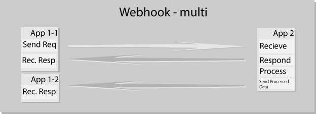
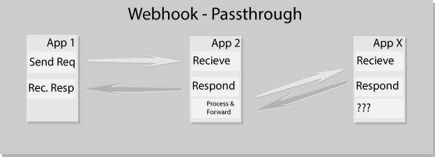
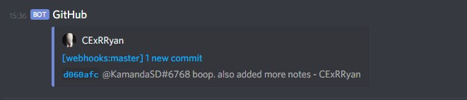

title: Webhooks Presentation
author:
    name: Ryan Reabel
    twitter: reabel
    url: http://reabelx.com
output: presentation.html
controls: true
theme: sudodoki/reveal-cleaver-theme
--

<!-- WIP, based off MySql presentation -->

# Webhooks
## AKA Web Callback or HTTP Push API
<!-- test comment-->

--

## Regular API Calls vs Webhooks

* Webhooks are more of a style than a specification
* Think REST vs SOAP

--

### Api Calls

--

* Wait for a response typically
* response is usually formatted in some manner, following a defined spec
* processed data is sent in the response to the initial call

--

### Webhooks

* Typically triggered by an call, posted to a defined url
* Any processed data would be sent via a separate call typically
* Common Terms:
  * Event
  * Listener / Consumer
  * Payload
* Usually "Subscribed" to (one time setup) by the end user (ie repo owner on github points their webhook API to an app), as opposed to requesting information via GET

--

## Single Webhooks

--

## Multiple Webhooks

--

## Passing Through Webhooks

-- 

## Live Demo / Code Comparison (Node)

--

# Use Cases / Examples

--

### Discord / Slack integrations

* Admins can configure webhooks to post notifications to servers or channels

--

### Paypal

* Used by Paypal for event notification, full API available

--

### Travis CI / Github

* Github has an api available that you can use to receive commit data from repositories where configured

* Travis CI uses webhooks from github to trigger builds

--

### Others

* [Bitbucket](https://developer.atlassian.com/bitbucket/api/2/reference/resource/hook_events)
* [Instagram](https://developers.facebook.com/docs/instagram-api/guides/webhooks)
* [Shopify](https://help.shopify.com/en/api/getting-started/webhooks)

--

### Resources

* [ELI5](https://dev.to/_bigblind/comment/11oo) of webhooks
* presentation created in [cleaver](https://www.npmjs.com/package/cleaver)
* [Webhooks vs serverless](https://dev.to/oktadev/webhooks-vs-serverless-1end)
* [Paypal's](https://developer.paypal.com/docs/integration/direct/webhooks/#overview) description of their webhooks
* [Github's](https://developer.github.com/webhooks/) setup of Webhook consumers
* [Travis-CI's](https://docs.travis-ci.com/user/notifications/#configuring-webhook-notifications) configuration for notifications

--